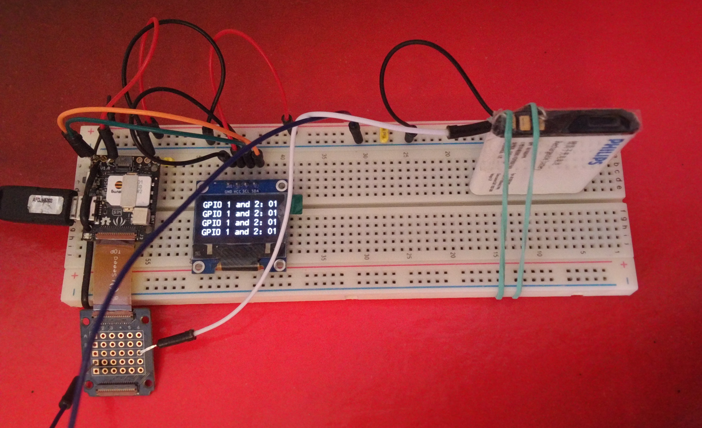
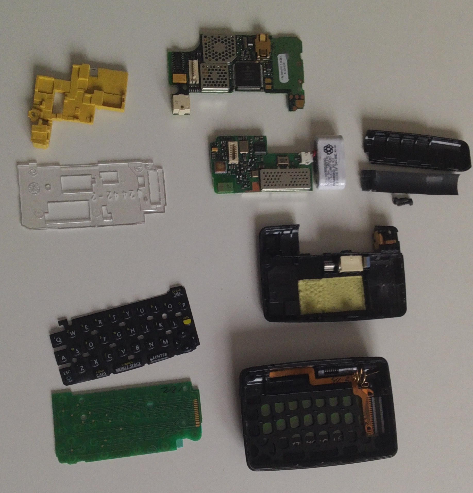

= 2g interactive pager

== hardware

MT2502 based RePhone/Xadow GSM module, Li-ion battery, ssd1306 based 128x64 monochrome I2C OLED display, handheld qwerty keyboard

== software

slightly modified https://github.com/loboris/RePhone_on_Linux, a base for lua apps to work on MT2502

== prerequisites for local dev

lua 5.1+
luabitop (for font pivot)

== current state

when turned on, displays four rows of `GPIO 1 and 2: 0 0` with a GPIO 1 and 2 states read once per second:

also almost completely disassembled donor:

== debug

    screen /dev/cu.usbmodem1411 115200

== GOTCHAS

global variables cannot be addressed from functions in init.lua (use local)
there's not viable option to load files from directories (e.g. font/CHARSET)
